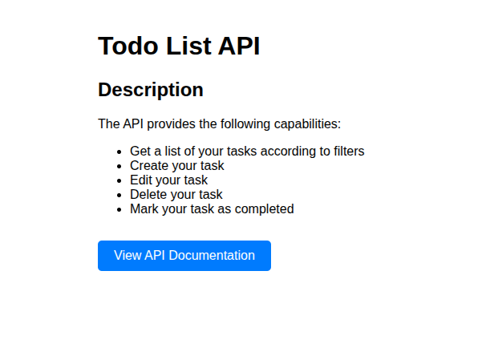
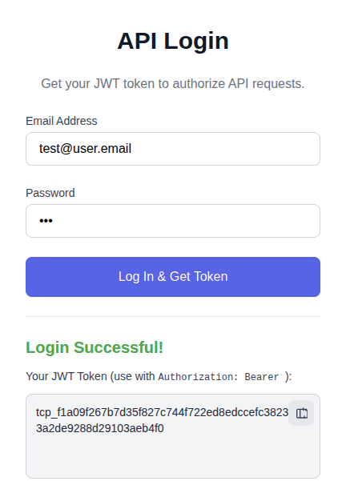
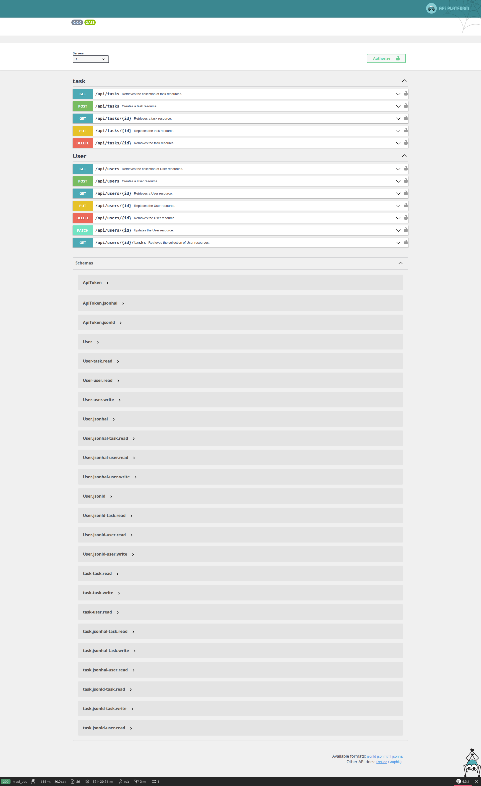

# Todo List API

[](#)


---

## Description

This API provides the ability to:

* Retrieve a list of your tasks with filters.
* Create your own tasks.
* Edit your tasks.
* Delete your tasks.
* Mark your tasks as completed.





---

## How to Run

**Docker-ready project**
All Docker variables are read from the `.env` file — just run `make build` to create a new instance.

---

### 1. **Clone the Symfony Project**

```bash
git clone https://github.com/ZhoraKornev/task_planner.api
cp .env.example .env
cd task_planner.api
```

### 2. **Prepare Docker Compose Override**

Create a file:
`docker-compose.override.yml`
and configure services such as PHP, Nginx/Apache, MySQL/MariaDB, etc.

### 3. **Build and Start Containers**

```bash
docker compose up -d
```

### 4. **Enter the PHP Container**

```bash
docker compose exec php bash
```

### 5. **Install Composer Dependencies**

Inside the PHP container:

```bash
composer install
```

### 6. **Run Symfony Commands**

```bash
bin/console cache:clear
bin/console doctrine:migrations:migrate
bin/console doctrine:fixtures:load
```

### 7. **Access the Application**

Open the app in your browser:

```
http://localhost
```

Use the test credentials from fixtures:

```
Email: App\DataFixtures\AppFixtures::TEST_USER_EMAIL ('test@user.email')
Pass:  App\DataFixtures\AppFixtures::TEST_USER_PASS  (123)
```

### 8. **Stop Containers**

```bash
docker compose down
```

---

## Helpful Docs

OpenAPI 3 ready.
All documentation & endpoints are available at:

```
http://localhost/api_documentation
```



---

## Tech Stack

* **Nginx**
* **PHP 8.2**
* **MariaDB 10.10.3**
* **RabbitMQ**
* **Symfony 6.3**
